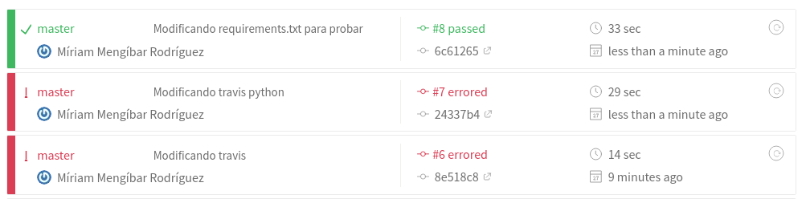
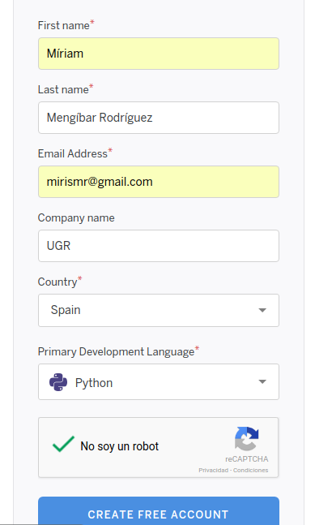
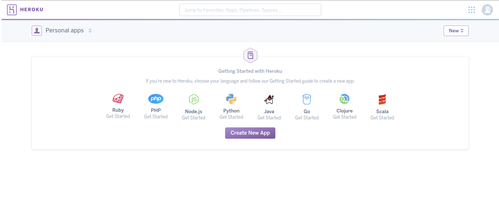
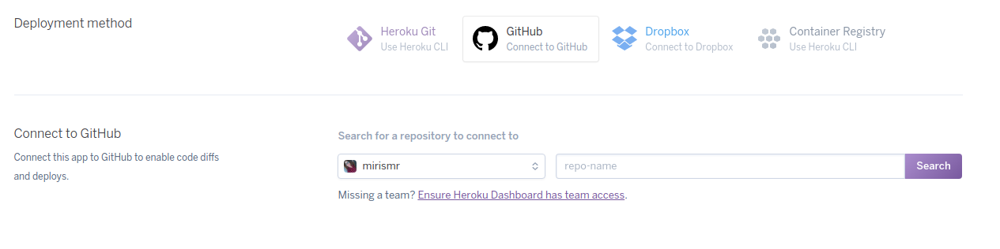
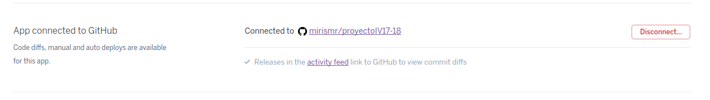
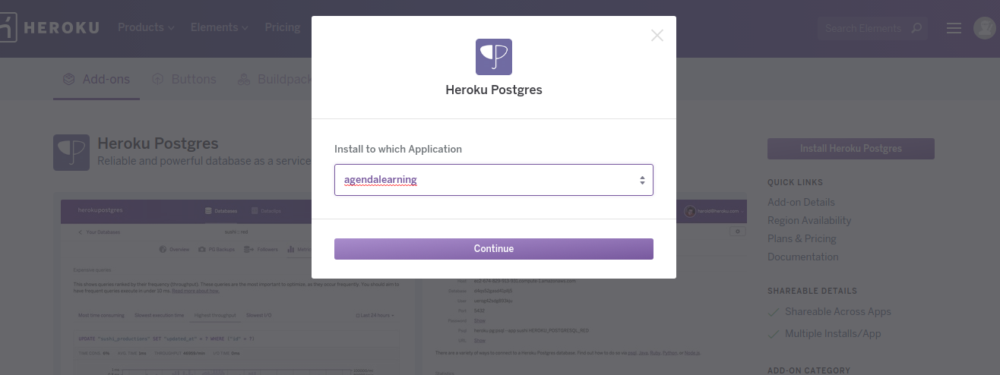
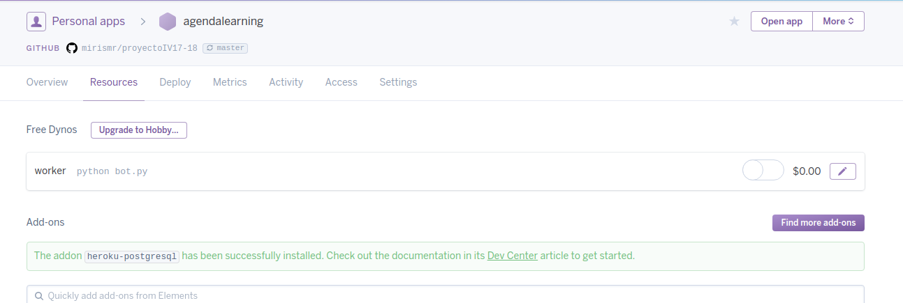
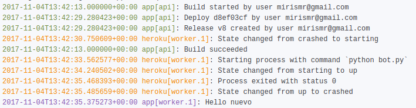

# Proyecto de Infraestructura Virtual
Aquí se expondrá información extra del proyecto.

## Configuración TravisCI

Lo primero que debemos hacer es entrar en la [página de TravisCI](https://travis-ci.org/) y logearnos con nuestro perfil de *GitHub*. Damos permiso para poder trabajar con el servicio y elegimos el repositorio del proyecto.
A continuación, tal y como indican en esa misma página, debemos añadir el archivo `.travis.yml`, en el cual debemos incluir características interesantes de nuestro proyecto, por ejemplo: el lenguaje utilizado, cómo instalar las dependencias, realizar los tests, etc.

Lo primero que haremos será instalar las dependencias. Para ello, debemos tener un archivo llamado `requirements.txt`. En dicho archivo se incluyen las aplicaciones necesarias y la versión para nuestro proyecto. El comando que realizar esta tarea es `pip3 install -r requirements.txt`.

Para la realización de los tests simplemente debemos ejecutar el comando `python tests.py`, siendo `tests.py` el archivo donde se encuentran los tests de mi proyecto.

Así pues, para automatizar esta tarea, nos vamos a servir de un fichero *Makefile*:
~~~
install:
    pip3 install -r requirements.txt

tests:
    python3 tests.py
~~~

Por lo cual, nuestro archivo `.travis.yml` es:
~~~
language: python
python:
  - "3.0"

install: make install

script: make tests
~~~

Ahora si nos vamos a la web podemos ver el resultado:

## Configuración despliegue en Heroku
Instalamos el toolbelt con el siguiente comando: `wget -O- https://toolbelt.heroku.com/install-ubuntu.sh | sh`

Nos damos de alta en *Heroku*. Lo hacemos a través de su [página oficial](https://signup.heroku.com/?c=70130000001x9jEAAQ):

Una vez hecho esto, confirmamos la cuenta en el correo y establecemos la contraseña. Se nos redirigirá a la página inicial de *Heroku*:

A continuación añadimos nuestra aplicación tal y como se muestra en la siguiente imagen:

Ahora enlazamos nuestro repositorio de *GitHub* con *Heroku*, indicando el nombre de nuestro repositorio. Además podemos automatizar el proceso de que cuando se haga un push se despliegue automáticamente (y pasando los test de *TravisCI*). El proceso se muestra en las siguientes imágenes:

Lo siguiente que debemos hacer es crear una base de datos *PostgreSQL*. Para ello instalamos el *addon* de *PostgreSQL* en nuestra aplicación:

Una vez hecho esto, ya tenemos todo configurado respecto a lo que tenemos que hacer en la página de *Heroku*. A continuación, debemos crear en nuestro repositorio un archivo llamado `Procfile`, que contendrá la información acerca de lo que tiene que hacer *Heroku* para desplegar nuestra aplicación. En mi caso, será ejecutar el archivo `bot.py`, así que contendrá la siguiente línea de código:

`worker: python3 bot.py`

Una vez hecho esto, trabajaremos normal y haremos tantos push como deseemos. Si nos vamos a la página de log de *Heroku* veremos que nuestro bot está funcionando (Primera versión de prueba que solo imprime una cadena):

