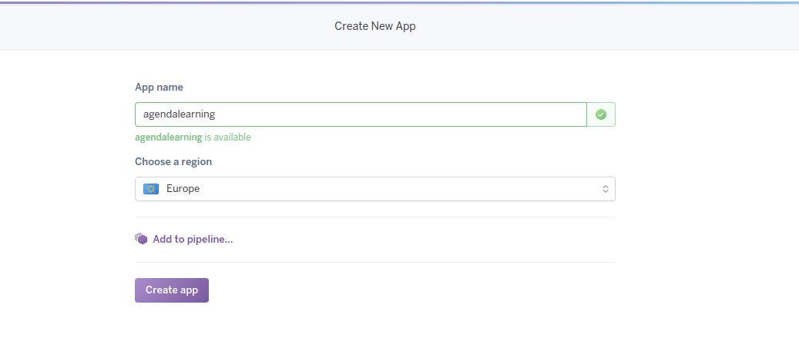
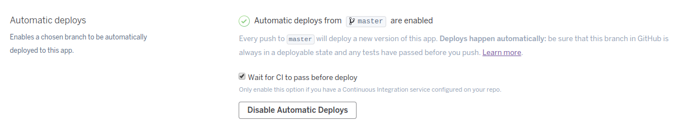

# Proyecto de Infraestructura Virtual
Aquí se expondrá información extra del proyecto.

## Configuración TravisCI

Lo primero que debemos hacer es entrar en la [página de TravisCI](https://travis-ci.org/) y logearnos con nuestro perfil de *GitHub*. Damos permiso para poder trabajar con el servicio y elegimos el repositorio del proyecto.
A continuación, tal y como indican en esa misma página, debemos añadir el archivo `.travis.yml`, en el cual debemos incluir características interesantes de nuestro proyecto, por ejemplo: el lenguaje utilizado, cómo instalar las dependencias, realizar los tests, etc.

Lo primero que haremos será instalar las dependencias. Para ello, debemos tener un archivo llamado `requirements.txt`. En dicho archivo se incluyen las aplicaciones necesarias y la versión para nuestro proyecto. El comando que realizar esta tarea es `pip3 install -r requirements.txt`.

Para la realización de los tests simplemente debemos ejecutar el comando `python tests.py`, siendo `tests.py` el archivo donde se encuentran los tests de mi proyecto.

Así pues, para automatizar esta tarea, nos vamos a servir de un fichero *Makefile*:
~~~
install:
    pip3 install -r requirements.txt

tests:
    python3 tests.py
~~~

Por lo cual, nuestro archivo `.travis.yml` es:
~~~
language: python
python:
  - "3.0"

install: make install

script: make tests
~~~

Ahora si nos vamos a la web podemos ver el resultado:

## Configuración despliegue en Heroku
Instalamos el toolbelt con el siguiente comando: `wget -O- https://toolbelt.heroku.com/install-ubuntu.sh | sh`

Nos damos de alta en *Heroku*. Lo hacemos a través de su [página oficial](https://signup.heroku.com/?c=70130000001x9jEAAQ):

Una vez hecho esto, confirmamos la cuenta en el correo y establecemos la contraseña. Se nos redirigirá a la página inicial de *Heroku*:

A continuación añadimos nuestra aplicación tal y como se muestra en la siguiente imagen:

Ahora enlazamos nuestro repositorio de *GitHub* con *Heroku*, indicando el nombre de nuestro repositorio. Además podemos automatizar el proceso de que cuando se haga un push se despliegue automáticamente (y pasando los test de *TravisCI*). El proceso se muestra en las siguientes imágenes:

Lo siguiente que debemos hacer es crear una base de datos *PostgreSQL*. Para ello instalamos el *addon* de *PostgreSQL* en nuestra aplicación:

Una vez hecho esto, ya tenemos todo configurado respecto a lo que tenemos que hacer en la página de *Heroku*. A continuación, debemos crear en nuestro repositorio un archivo llamado `Procfile`, que contendrá la información acerca de lo que tiene que hacer *Heroku* para desplegar nuestra aplicación. En mi caso, será ejecutar el archivo `bot.py`, así que contendrá la siguiente línea de código:

`worker: python3 bot.py`

y `web: gunicorn web:app --log-file=-`

Una vez hecho esto, trabajaremos normal y haremos tantos push como deseemos. Si nos vamos a la página de log de *Heroku* veremos que nuestro bot está funcionando (Primera versión de prueba que solo imprime una cadena):

Nota: Como nuestro despliegue no tiene sentido en la web (ya que solamente es un archivo .py ejecutándose que dará vida al bot) si accedemos a la dirección del [despliegue](https://agendalearning.herokuapp.com/) nos dará *status:ok*, pero basta con fijarnos en los logs para comprobar que efectivamente funciona.
También podemos comprobarlo en [*Telegram*](https://web.telegram.org/#/im?p=@agendaLearningBot).

## Instalación Docker

Seguimos los pasos de la [documentación de Digital Ocean](https://www.digitalocean.com/community/tutorials/how-to-install-and-use-docker-on-ubuntu-16-04).

Añadimos la clave GPG con `curl -fsSL https://download.docker.com/linux/ubuntu/gpg | sudo apt-key add -` y ejecutamos para añadir el repositorio `sudo add-apt-repository "deb [arch=amd64] https://download.docker.com/linux/ubuntu $(lsb_release -cs) stable"`.

Actualizamos los repos `sudo apt-get update` y con `apt-cache policy docker-ce` vemos:

Para instalar Docker introducimos el comando `sudo apt-get install -y docker-ce`:

Comprobamos que está activo:

## Usando Docker y DockerHub

Primero haremos las pruebas en local y a continuación usaremos *DockerHub*.

Lo primero de todo será crear el Dockerfile: 
~~~
FROM ubuntu:14.04
MAINTAINER Míriam Mengíbar Rodríguez <mirismr@correo.ugr.es>

ARG TOKEN_BOT
ENV TOKEN_BOT=$TOKEN_BOT

#Instalamos git
RUN sudo apt-get -y update
RUN sudo apt-get install -y git

#Clonamos el repositorio
RUN sudo git clone https://github.com/mirismr/proyectoIV17-18.git

#Instalamos las herramientas de python necesarias
RUN sudo apt-get -y install python3-setuptools
RUN sudo apt-get -y install python3-dev
RUN sudo apt-get -y install build-essential
RUN sudo apt-get -y install python3-psycopg2
RUN sudo apt-get -y install libpq-dev
RUN sudo apt-get -y install python3-pip

#Instalamos los requerimientos necesarios
RUN cd proyectoIV17-18 && make install
~~~

Este fichero se encargará de indicarle a Docker las dependencias y demás herramientas que necesita nuestra aplicación tener instaladas en el contenedor para que funcione.

Para la prueba en local, ejecutamos el comando `docker build -f Dockerfile -t ccontenedor-learningbot .`:

Podemos ver como se ejecutarán todos los "pasos" de nuestro *Dockerfile*.
Cuando termine, podemos ver como se ha creado el contendor para nuestra aplicación:

A continuación ejecutamos el comando `sudo docker run --env TOKEN_BOT=XXX -i -t contenedor-learningbot /bin/bash`, donde se ha omitido el token del bot por privacidad, y ejecutamos el bot:

Podemos comprobar que funciona.

Para la disponibilidad en DockerHub, primero debemos registrarnos en la página de [Docker](https://hub.docker.com/), a través del sencillo formulario.
Nos llegará un correo de confirmación y ya estamos registrados.

Una vez hecho esto, nos dirigimos a "Settings" y, desde "Settings", a "Linked Accounts & Services". Elegimos GitHub, "Public and Private" y lo autorizamos:

Ahora nos dirigimos al menú "Create", "Create Automated Build". Seleccionamos GitHub de nuevo y el repositorio:

Quedando finalmente:

Para descargar y lanzar el contenedor ejecutamos: `sudo docker pull mirismr/proyectoiv17-18` y `sudo docker run --env TOKEN_BOT=XXX -i -t contenedor-learningbot /bin/bash`